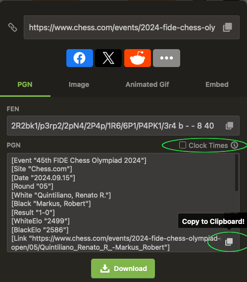

# Lichess PGN Importer

This is a simple tool to import a PGN file into Lichess. It uses the Lichess API to import the game and then prints the URL of the game.  After that, you can use the `lichess` command to open the game in your browser and request a computer analysis.

## Prerequisites

- [Docker](https://www.docker.com/get-started)
- [Lichess.org API Token](https://lichess.org/account/oauth/token) | [+info](https://lichess.org/api#section/Authentication)

## Quick Install

Run this command to install the Lichess PGN Importer:

```bash
curl -sSL https://raw.githubusercontent.com/jeancsil/lichess/main/install.sh | bash
```

This script will:

1. Check if the necessary executables are installed (`Docker`, `pbpaste`)
2. Pull the necessary Docker image
3. Set up the `lichess` command for easy execution

After installation, make sure to set your Lichess API token as an environment variable.

## Configuration

Set your Lichess API token as an environment variable:

```bash
export LICHESS_TOKEN=lip_exampleT0kenF0rL1chess123
```

## Usage

1. Copy a valid PGN (Portable Game Notation) for a chess game to your clipboard.
e.g.:


2. Ensure your `LICHESS_TOKEN` environment variable is set as described earlier.

3. Run the `lichess` command:

   ```bash
   lichess
   ```

   The application will read the PGN from your clipboard, save it to a temporary file, import it to Lichess, and provide you with the URL of the imported game.

Example output:

```bash
Game imported successfully: https://lichess.org/xXxYyYZzZ
```

## Uninstall

To uninstall the Lichess PGN Importer, you can use the following command:

```bash
curl -sSL https://raw.githubusercontent.com/jeancsil/lichess/main/uninstall.sh | bash
```

This script will:

1. Remove the `lichess` command from your system
2. Remove the Docker images used by the application

Alternatively, if you have cloned the repository, you can run:

```bash
make uninstall
```
